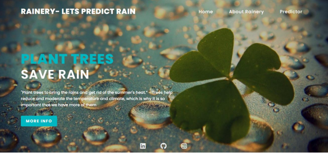
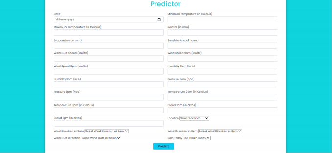
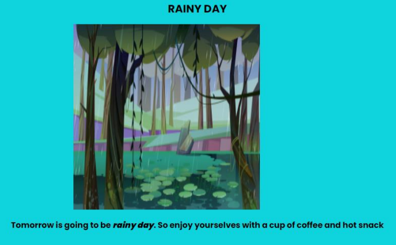

[![LinkedIn][linkedin-shield]][linkedin-url]

<!-- PROJECT LOGO -->
 

  

  <h1 align="center">Rainery</h1>

  

    Want to know if it will rain tommorrow? Come on, let's predict it!
     
     
    <a href="https://rainery.herokuapp.com/">View Demo</a>
    ·
    <a href="https://github.com/Himank-J/">Report Bug</a>
    ·
    <a href="https://github.com/Himank-J/">Request Feature</a>
  

<!-- TABLE OF CONTENTS -->
## Table of Contents

* [About the Project](#about-the-project)
  * [Built With](#built-with)
* [Getting Started](#getting-started)
* [Purpose](#purpose)
* [Contributing](#contributing)
* [License](#license)
* [Contact](#contact)

<!-- ABOUT THE PROJECT -->
## About The Project

 
Rainery is a platform that allows users to predict whether it will rain tommorrow or not. It makes use of a machine learning model to process user input data and make prediction on it. 
### **Features -** 
* Users can predict if it will rain tommorrow
* Easy to use application - only fill up the form and prediction will be made.
* Due to large number of features considered, obtained results are accurate.
* Creative result generation 

### Built With
This application is built with love, dedication, coffee and:
* Python Libraries
  * Pandas
  * Numpy
  * Seaborn
  * Matplotlib
  * Scikit-Learn
  * CatBoost
  * Imb-learn
  * Flask 
* Html/CSS
* 
App url - https://rainery.herokuapp.com/   

# Getting Started 
* First create a virtual environment by using this command:
* conda create -n myenv python=3.6
* Activate the environment using the below command:
* conda activate myenv
* Then install all the packages by using the following command
* pip install -r requirements.txt
* Now for the final step. Run the app
* python app.py

<!-- Purpose -->
## Purpose 

Rainfall Prediction is the application of science and technology to predict the amount of rainfall over a 
region. It is important to exactly determine the rainfall for effective use of water resources, crop 
productivity and pre-planning of water structures. Rainfall prediction is important as heavy rainfall can 
lead to many disasters. The prediction helps people to take preventive measures and moreover the 
prediction should be accurate. 
The aim of this project is to analyse historical data related to rainfall and use that data to develop a 
model using machine learning algorithm and that can predict whether it will rain tomorrow or not.

<!-- CONTRIBUTING -->
## Contributing

Contributions are what make the open source community such an amazing place to be learn, inspire, and create. Any contributions you make are **greatly appreciated**.

1. Fork the Project
2. Create your Feature Branch (`git checkout -b feature/AmazingFeature`)
3. Commit your Changes (`git commit -m 'Add some AmazingFeature'`)
4. Push to the Branch (`git push origin feature/AmazingFeature`)
5. Open a Pull Request

<!-- LICENSE -->
## License

Distributed under the MIT License. See `LICENSE` for more information.

<!-- CONTACT -->
## Contact

Himank Jain - [@callme__hj](https://instagram.com/callme__hj) - My Instagram  
Himank Jain - [himank-jain](https://www.linkedin.com/in/himank-jain/) - My LinkedIn   
Project Link: [https://github.com/Himank-J/Rainery](https://github.com/Himank-J/Rainery)

<!-- MARKDOWN LINKS & IMAGES -->
<!-- https://www.markdownguide.org/basic-syntax/#reference-style-links -->

[license-shield]: https://img.shields.io/github/license/othneildrew/Best-README-Template.svg?style=flat-square
[license-url]: https://github.com/othneildrew/Best-README-Template/blob/master/LICENSE.txt
[linkedin-shield]: https://img.shields.io/badge/-LinkedIn-black.svg?style=flat-square&logo=linkedin&colorB=555
[linkedin-url]: https://www.linkedin.com/in/himank-jain/
[product-screenshot]: images/search.png
